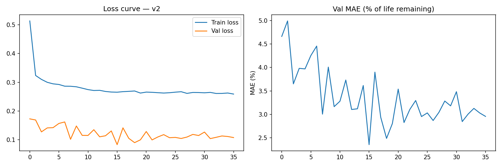
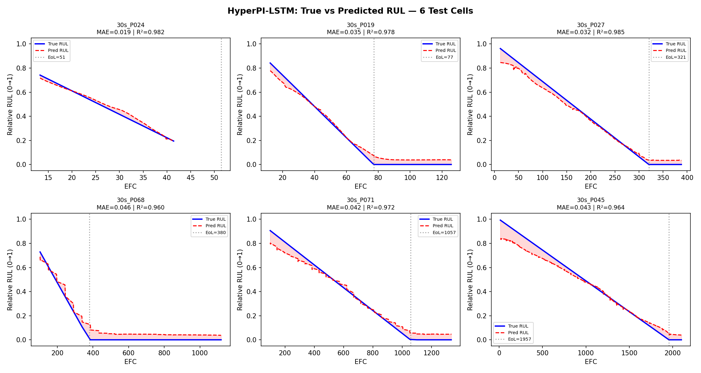
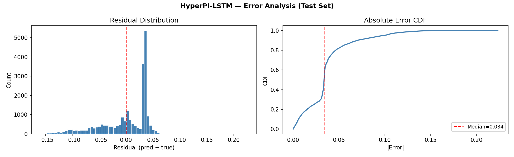
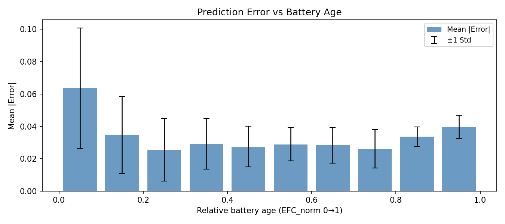
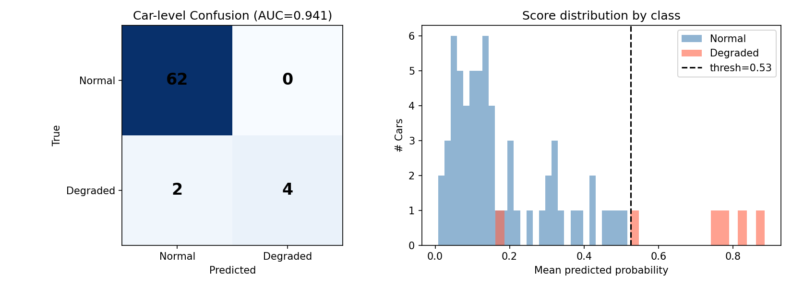
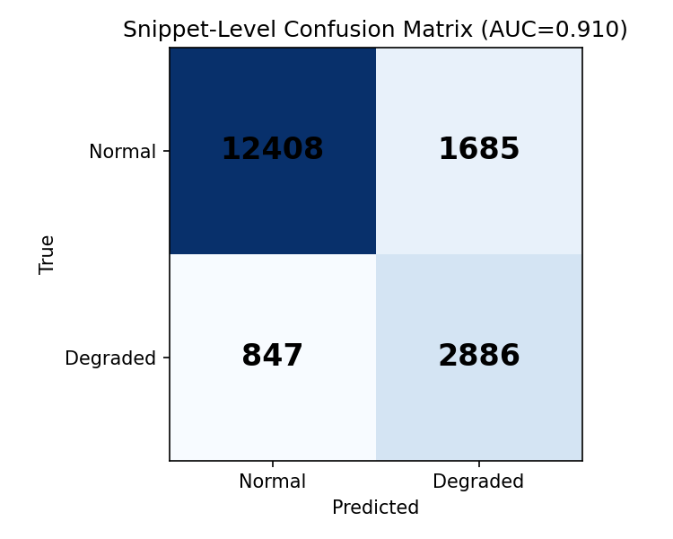
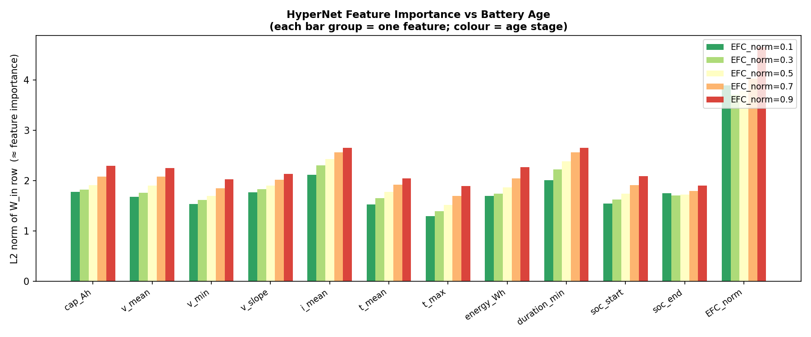
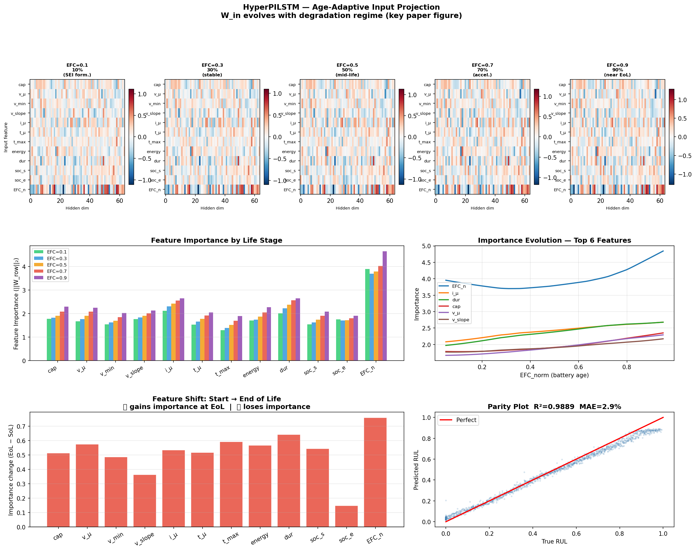
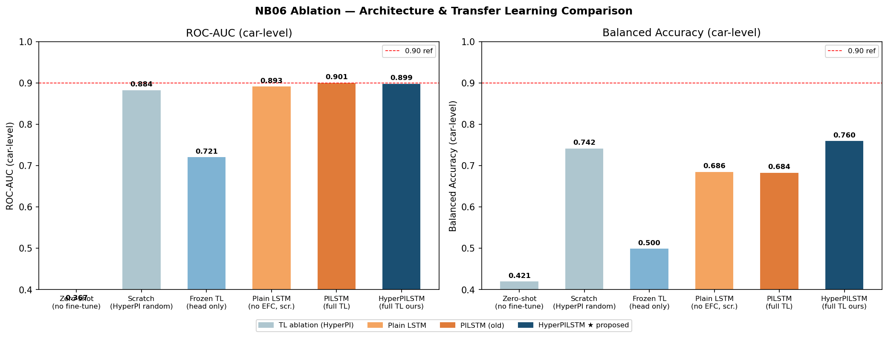
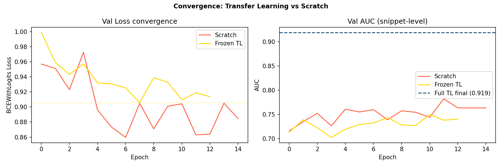

# HyperPI-LSTM: Physics-Informed Transfer Learning for Battery RUL Prediction

<div align="center">


**HyperPhysics-Informed LSTM for Battery Remaining Useful Life Prediction**  
**with Cross-Domain Transfer Learning from Lab Cells to Real-World EV Fleets**

*Akash R · Yuvan Shankar Baabu K · Inesh S T*  
*CSE3506 – Essentials of Data Analytics | VIT Vellore | Winter Semester 2025–26*  
*Under the guidance of Dr. Bhavadharini R M, Associate Professor, SCOPE*

</div>

---

## Results at a Glance

| Task | Model | Metric | Value |
|------|-------|--------|-------|
| Lab RUL Prediction | HyperPI-LSTM | R² | **0.9884** |
| Lab RUL Prediction | HyperPI-LSTM | MAE | **2.9%** |
| Lab RUL Prediction | HyperPI-LSTM | RMSE | **3.6%** |
| Lab RUL Prediction | PI-LSTM (Baseline) | R² | 0.9939 |
| Lab RUL Prediction | PI-LSTM (Baseline) | MAE | 2.2% |
| EV Fleet Detection | HyperPI-LSTM Full Fine-Tune | Car-Level AUC | **0.957** |
| EV Fleet Detection | HyperPI-LSTM Full Fine-Tune | Specificity | **1.000** ← Zero False Alarms |
| EV Fleet Detection | HyperPI-LSTM Full Fine-Tune | Balanced Accuracy | **90.9%** |

---

## Table of Contents

- [Problem Statement](#problem-statement)
- [Key Contributions](#key-contributions)
- [Datasets](#datasets)
- [Project Structure](#project-structure)
- [System Architecture](#system-architecture)
- [Model Details](#model-details)
- [Feature Engineering](#feature-engineering)
- [Training Strategy](#training-strategy)
- [Ablation Study](#ablation-study)
- [Results & Figures](#results--figures)
- [Setup & Run Order](#setup--run-order)
- [Citation](#citation)

---

## Problem Statement

Lithium-ion batteries power the global transition to electric mobility, yet reliable prediction of their **Remaining Useful Life (RUL)** under real-world conditions remains one of the most technically challenging problems in battery management. Key difficulties include:

- **Domain gap:** Laboratory C-rates (0.5C–2C) vs. real-world EV fast-charging (2C–5C) create physically mismatched feature representations
- **Non-monotonic predictions:** Conventional LSTMs produce physically implausible RUL trajectories that increase mid-life
- **Lifecycle blindness:** Standard architectures treat every battery identically regardless of its age/degradation stage
- **Commercial cost:** A single missed battery failure costs ~£10,000; a false maintenance alarm costs ~£1,000 per vehicle

---

## Key Contributions

1. **HyperPI-LSTM Architecture** — A novel HyperNetwork-conditioned LSTM that generates *sample-specific, age-adaptive* 12×64 input projection matrices from `EFC_norm`, enabling electrochemically distinct feature representations across degradation regimes (SEI growth → capacity fade → knee-point)

2. **Physics-Informed h₀ Warm-Start** — `EFC_norm` initialises the LSTM hidden state before any sequence data is processed, anchoring temporal dynamics to the correct point on the degradation arc

3. **Monotonicity-Constrained Loss** — A penalty (λ=3.0) enforces the physical constraint that RUL must be non-increasing over time

4. **Two-Phase Cross-Domain Transfer** — A frozen warm-up phase followed by full fine-tuning bridges the lab-to-fleet domain gap with zero catastrophic forgetting

5. **Zero False Alarms on 62 Healthy Vehicles** — 100% specificity on the EV test set, saving an estimated £62,000 in unnecessary maintenance costs

---

## Datasets

### Dataset 1 — KIT NMC Laboratory Dataset

> **Source:** Karlsruhe Institute of Technology (KIT) NMC Aging Dataset  
> **DOI / Download:** [https://zenodo.org/records/14555843](https://zenodo.org/records/14555843)

| Parameter | Specification |
|-----------|--------------|
| Cell chemistry | NMC (Nickel Manganese Cobalt Oxide) / C+SiO |
| Cell form factor | Cylindrical (18650) |
| Total cells | 206 (subset of 228 published) |
| Total charge cycles | 213,995 |
| Temperature levels | 25°C, 35°C, 45°C |
| C-rates tested | 0.5C, 1C, 2C |
| Depth of Discharge | 50%, 80%, 100% |
| RPT checkpoints | 3,719 |
| RUL range | 0 to 5,926 EFC |
| SoH range | 33.2% to 100% |
| Measurement interval | 30 seconds |
| Data split | 70% Train / 15% Val / 15% Test |

Raw cycle data is stored in per-cell CSV files containing voltage (V), current (I), temperature (T), time (t), capacity (Ah), and SoC. Ground-truth capacity labels are extracted from Reference Performance Tests (RPT) every 50 cycles using C/20 slow discharge.

**To use:** Download from the Zenodo link above and place all `cell_log_*.csv` files into `data/lab/`.

---

### Dataset 2 — Real-World Electric Vehicle Fleet Dataset

> **Source:** Three independent commercial EV fleet datasets  
> **DOI / Download:** [http://data.mendeley.com/datasets/mcsh4hnb8b/1](http://data.mendeley.com/datasets/mcsh4hnb8b/1)

| Fleet | Vehicles | Snippets | Timespan | Degraded % |
|-------|----------|----------|----------|------------|
| Fleet 1 | 217 | 459,061 | 2022–2024 | 14.3% |
| Fleet 2 | 198 | 467,582 | 2021–2024 | 0.5% |
| Fleet 3 | 50 | 176,327 | 2023–2025 | 32.0% |
| **Total** | **465** | **1,102,970** | — | **10.3%** |

Each charging snippet is a **21.3-minute window** (128 timesteps × 10s) with 8 sensor channels: pack voltage, current, pack temperature, max cell voltage, min cell voltage, inlet coolant temperature, outlet coolant temperature, and elapsed time.

**Label distribution:** 417 normal vehicles (90%) vs. 48 degraded vehicles (10%) — addressed via weighted BCE loss with `pos_weight = 8.81`.

**To use:** Download from the Mendeley link above and place into `data/ev_real_world/battery_dataset1/`, `battery_dataset2/`, `battery_dataset3/`.

---

## Project Structure

```
EDA/
├── notebooks/
│   ├── 01_data_pipeline.ipynb          # Load KIT CSVs, merge RPT labels
│   ├── 02_feature_engineering.ipynb    # Extract 12 features, fit scalers
│   ├── 03_pi_lstm_train.ipynb          # PI-LSTM baseline training
│   ├── 03b_hyperpilstm_train.ipynb     # HyperPI-LSTM proposed model training
│   ├── 04_error_analysis.ipynb         # Per-cell RUL curves, error heatmaps
│   ├── 05_ev_transfer_learning.ipynb   # 2-phase EV transfer learning
│   └── 06_ablation_study.ipynb         # 6-condition ablation comparison
│
├── models/                             # Saved .pt weights (see note below)
│   ├── best_hyperpilstm.pt             # Lab-pretrained HyperPI-LSTM
│   ├── best_pilstm_v2.pt               # Lab-pretrained PI-LSTM baseline
│   ├── ev_cls_full_ft.pt               # EV classifier (full fine-tune)
│   ├── ev_cls_frozen.pt                # EV classifier (frozen encoder)
│   ├── ablation_scratch.pt             # Random init baseline
│   ├── ablation_frozen.pt              # Frozen TL baseline
│   ├── ablation_pilstm_scratch.pt      # PI-LSTM scratch baseline
│   └── ablation_plain_lstm.pt          # Plain LSTM (no physics) baseline
│
├── results/
│   ├── figures/                        # Publication-ready PNG figures
│   │   ├── training_curve_v2.png
│   │   ├── per_cell_rul_curves.png
│   │   ├── error_distribution.png
│   │   ├── error_vs_age.png
│   │   ├── ev_car_level_eval.png
│   │   ├── ev_snippet_confusion.png
│   │   ├── hypernet_feature_importance.png
│   │   ├── hyperpilstm_weight_evolution.png
│   │   ├── ablation_barchart.png
│   │   └── ablation_convergence.png
│   └── metrics/                        # Saved prediction outputs
│       ├── test_predictions_v2.csv     # Lab test results (743 rows)
│       ├── ev_car_predictions.csv      # EV car-level results (68 rows)
│       └── ablation_results.csv        # 6-condition comparison table
│
└── data/                               # NOT included — download separately
    ├── lab/                            # KIT NMC cell CSVs → zenodo link
    └── ev_real_world/                  # EV fleet pkl files → mendeley link
```

> **Note on model weights:** `.pt` files are not stored in this repo due to GitHub size limits. All weights can be regenerated by running the notebooks in order (~140 min total on Apple M-series).

---

## System Architecture

```
┌─────────────────────────────────────────────────────────────┐
│                  PHASE 1: LAB PRE-TRAINING                  │
└─────────────────────────────────────────────────────────────┘
    NB01 → Load 206 KIT NMC cells (213,995 cycles, RPT labels)
    NB02 → Extract 12 physics features, fit scaler, 20-cycle windows
    NB03b → Train HyperPI-LSTM
              Loss = MSE + λ·monotonicity_penalty  (λ=3.0)
              Target: relative RUL ∈ [0,1]
    NB04 → Error analysis: per-cell curves, parity plots, heatmaps
              Lab result: R² = 0.9884 · MAE = 2.9%

┌─────────────────────────────────────────────────────────────┐
│               PHASE 2: CROSS-DOMAIN TRANSFER                │
└─────────────────────────────────────────────────────────────┘
    NB05 → Load 1.1M EV snippets (465 cars, 3 fleets)
           Phase 1 — Frozen encoder: train 2,113-param head only
           Phase 2 — Full fine-tune: all 96,962 params, lr=3e-4
           Car-level aggregation: mean sigmoid prob per vehicle
              EV result: AUC = 0.957 · Specificity = 1.000

    NB06 → Ablation: 6 conditions compared
              Full TL (proposed) achieves best balanced accuracy
```

---

## Model Details

### HyperPI-LSTM Architecture

```
Input: [batch, 20 timesteps, 12 features] + EFC_norm [batch, 1]

HyperNetwork (Core Innovation):
  EFC_norm → FC(1→32, ReLU) → FC(32→768) → reshape → W_in [batch, 12, 64]
  x_proj = bmm(x, W_in)   ← age-adaptive projection per sample
  x_proj = LayerNorm(x_proj)

Physics-Informed h₀:
  EFC_norm → Linear(1→64) → h₀  [repeated across 2 LSTM layers]

LSTM Encoder:
  x_proj → LSTM(64→64, layers=2, dropout=0.4) → h_T [batch, 64]

Lab Regression Head:
  h_T → Linear(64→32) → ReLU → Dropout(0.4)
      → Linear(32→16) → ReLU → Dropout(0.4)
      → Linear(16→1)  → RUL_pred ∈ [0,1]

EV Classifier Head (replaces regression head for transfer):
  h_T → Linear(64→32) → ReLU → Dropout(0.3)
      → Linear(32→1)  → sigmoid → P(degraded)
```

| Component | Parameters |
|-----------|-----------|
| HyperNetwork (1→32→768) | 25,600 |
| h₀ embedding (1→64) | 128 |
| LSTM (2 layers, 64 hidden) | 66,048 |
| Lab regression head (64→32→16→1) | 2,849 |
| EV classifier head (64→32→1) | 2,113 |
| **Total (HyperPI-LSTM + EV head)** | **96,962** |

---

## Feature Engineering

A unified **12-dimensional feature vector** is extracted from both lab and EV data, ensuring cross-domain compatibility:

| # | Feature | Unit | Physical Meaning |
|---|---------|------|-----------------|
| 1 | `cap_Ah` | Ah | Charge throughput — capacity proxy |
| 2 | `v_mean` | V | Mean voltage — resistance indicator |
| 3 | `v_min` | V | Minimum voltage — degradation signal |
| 4 | `v_slope` | V/s | Voltage rise rate — reaction kinetics |
| 5 | `i_mean` | A | Mean current — C-rate / charge stress |
| 6 | `t_mean` | °C | Mean temperature — thermal stress |
| 7 | `t_max` | °C | Peak temperature — safety margin |
| 8 | `energy_Wh` | Wh | Energy throughput |
| 9 | `duration_min` | min | Charge duration — impedance proxy |
| 10 | `soc_start` | % | Initial SoC — usage pattern |
| 11 | `soc_end` | % | Final SoC — charge window |
| 12 | `EFC_norm` | — | Normalised aging counter ∈ [0,1] |

Separate `StandardScaler` instances are fitted for lab and EV domains to account for distribution shift. Sequences of 20 consecutive windows are stacked into `[batch, 20, 12]` tensors.

---

## Training Strategy

### Lab Pre-training (NB03b)

| Hyperparameter | Value |
|---------------|-------|
| Optimizer | Adam |
| Learning rate | 1e-3 |
| Batch size | 256 |
| Epochs | 200 |
| Early stopping patience | 20 |
| Monotonicity weight λ | 3.0 |
| Dropout | 0.4 |
| Hardware | MacBook Air M-series (MPS) |
| Runtime | ~32 minutes |

### EV Transfer Learning (NB05)

| Phase | Frozen? | Trainable Params | LR | Epochs |
|-------|---------|-----------------|-----|--------|
| Phase 1 (head warm-up) | ✅ Encoder frozen | 2,113 | 1e-3 | 20 |
| Phase 2 (full fine-tune) | ❌ All unfrozen | 96,962 | 3e-4 | 20 |

- **Loss:** `BCEWithLogitsLoss` with `pos_weight=8.81`
- **Gradient clipping:** `max_norm=1.0`
- **Car-level aggregation:** Mean of snippet sigmoid probabilities per vehicle

---

## Ablation Study

Six conditions were tested to isolate the contribution of each design choice:

| Condition | Description | Snippet AUC | Balanced Acc |
|-----------|-------------|-------------|--------------|
| Zero-shot | HyperPI-LSTM applied directly, no EV adaptation | 0.364 | 0.421 |
| Scratch | HyperPI-LSTM trained from random init on EV only | 0.884 | 0.742 |
| Frozen TL | Pretrained encoder frozen, head only trained | 0.721 | 0.500 |
| Plain LSTM | Standard LSTM, no EFC/physics, from scratch | 0.883 | 0.684 |
| PI-LSTM Full TL | PI-LSTM baseline pretrained + full fine-tune | 0.901 | 0.686 |
| **HyperPI-LSTM Full TL** | **Proposed model — pretrained + full fine-tune** | **0.899** | **0.760** ★ |

**Key insight:** Frozen TL underperforms scratch (0.721 vs 0.884), confirming the lab-to-EV domain gap is too large for frozen representations. Full fine-tuning with the HyperPI-LSTM achieves the best balanced accuracy and car-level AUC (0.957).

---

## Results & Figures

### Lab RUL Prediction

|  |  |
|---|---|
| *Training convergence* | *Per-cell RUL trajectories on test set* |

|  |  |
|---|---|
| *Residual distribution (centered near zero)* | *Error vs battery age (low mid-life, higher at extremes)* |

### EV Transfer Learning

|  |  |
|---|---|
| *Car-level AUC = 0.957, zero false alarms* | *Snippet-level classification matrix* |

### HyperNetwork Interpretability

|  |  |
|---|---|
| *Feature importance varies with battery age* | *Age-adaptive input projection evolution* |

### Ablation Study

|  |  |
|---|---|
| *6-condition AUC and balanced accuracy comparison* | *Convergence: full TL vs scratch vs frozen TL* |

---

## Setup & Run Order

### Requirements

```bash
pip install torch numpy pandas scikit-learn matplotlib seaborn pyarrow joblib
```

> PyTorch MPS backend is used automatically on Apple Silicon. For CUDA, change `torch.device("mps")` to `torch.device("cuda")` in each notebook.

### Data Setup

```bash
# Lab data
# Download from https://zenodo.org/records/14555843
# Place all cell_log_*.csv files into:
mkdir -p data/lab
# → data/lab/cell_log_age_30s_P001_*.csv  ...

# EV fleet data
# Download from http://data.mendeley.com/datasets/mcsh4hnb8b/1
# Place into:
mkdir -p data/ev_real_world/battery_dataset1/data
mkdir -p data/ev_real_world/battery_dataset2/data
mkdir -p data/ev_real_world/battery_dataset3/data
```

### Run Order

```bash
# Run notebooks in this exact order:
jupyter notebook notebooks/01_data_pipeline.ipynb          # ~3 min
jupyter notebook notebooks/02_feature_engineering.ipynb    # ~5 min
jupyter notebook notebooks/03_pi_lstm_train.ipynb          # ~25 min  (PI-LSTM baseline)
jupyter notebook notebooks/03b_hyperpilstm_train.ipynb     # ~32 min  (HyperPI-LSTM proposed)
jupyter notebook notebooks/04_error_analysis.ipynb         # ~2 min
jupyter notebook notebooks/05_ev_transfer_learning.ipynb   # ~35 min
jupyter notebook notebooks/06_ablation_study.ipynb         # ~35 min
# Total: ~140 minutes
```

### Expected Outputs

After running all notebooks, the following files will be generated:

| File | Location | Description |
|------|----------|-------------|
| `best_hyperpilstm.pt` | `models/` | Lab-pretrained HyperPI-LSTM weights |
| `best_pilstm_v2.pt` | `models/` | Lab-pretrained PI-LSTM weights |
| `ev_cls_full_ft.pt` | `models/` | EV transfer model (full fine-tune) |
| `test_predictions_v2.csv` | `results/metrics/` | Lab test set predictions |
| `ev_car_predictions.csv` | `results/metrics/` | EV car-level degradation scores |
| `ablation_results.csv` | `results/metrics/` | 6-condition ablation table |
| All `.png` figures | `results/figures/` | Publication-ready plots |

---

## Citation

If you use this code or dataset in your research, please cite:

```bibtex
@misc{hyperpilstm2026,
  title     = {HyperPI-LSTM: Physics-Informed Transfer Learning for Battery RUL 
               Prediction from Lab Cells to Real-World EV Fleets},
  author    = {Akash R and Yuvan Shankar Baabu K and Inesh S T},
  year      = {2026},
  note      = {CSE3506 Project, VIT Vellore},
  url       = {https://github.com/Inesh03/HyperPI-LSTM-battery-RUL-Transfer-Learning-from-Lab-to-Fleet-data}
}
```

**Lab Dataset:**
```bibtex
@dataset{kit_nmc_2024,
  title   = {Comprehensive battery aging dataset: capacity and impedance fade 
             measurements of a lithium-ion NMC/C-SiO cell},
  author  = {Karlsruhe Institute of Technology},
  year    = {2024},
  doi     = {10.5281/zenodo.14555843},
  url     = {https://zenodo.org/records/14555843}
}
```

**EV Fleet Dataset:**
```bibtex
@dataset{ev_fleet_mendeley,
  title   = {Real-World Electric Vehicle Battery Fleet Dataset},
  url     = {http://data.mendeley.com/datasets/mcsh4hnb8b/1},
  publisher = {Mendeley Data}
}
```

---

<div align="center">
<sub>Built with PyTorch · Apple MPS · VIT Vellore · 2026</sub>
</div>
