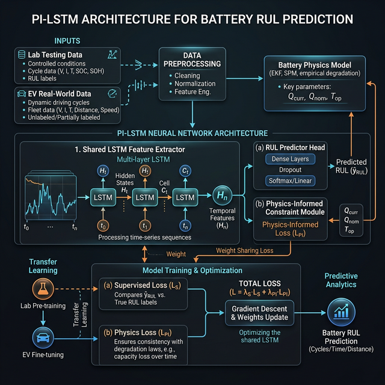

# Physics-Informed Transfer Learning for Real-World Battery RUL Prediction

Welcome to the **Physics-Informed Transfer Learning for Real-World Battery RUL (Remaining Useful Life) Prediction** repository. This project focuses on estimating and predicting the remaining useful life of batteries, leveraging a combination of deep learning techniques with physics-informed priors and transfer learning.

## Project Architecture & Flow



## Overview

Accurate prediction of Battery Remaining Useful Life (RUL) is critical for ensuring the reliability and safety of battery management systems in electric vehicles and consumer electronics. Traditional data-driven models often struggle with domain shifts when applied to real-world battery datasets due to varying operating conditions. This project introduces a Physics-Informed Transfer Learning approach to bridge the gap between source domains (e.g., lab-tested batteries) and target domains (real-world operations).

## Directory Structure

- `data/` - Contains the dataset files used for training and evaluating the prognostic models.
- `models/` - Stores the trained model weights and architectures.
- `notebooks/` - Jupyter notebooks for exploratory data analysis, prototype modeling, and visualization.
- `paper/` - Documentation, manuscript files, and related reports.
- `results/` - Output generated from experiments, including graphs and metric evaluations.
- `scripts/` - Executable scripts for automating tasks such as data preprocessing or training.
- `src/` - Core source code containing the neural network modules, physics-informed loss functions, and transfer learning utils.

## Methodology

This repository employs:
1.  **Physics-Informed Neural Networks (PINNs):** Integrating physical equations of battery degradation into the loss function to guide the neural network toward physically consistent predictions. For example, monotonicity and capacity physics losses ensure the RUL strictly decreases over time and is physically constrained by current capacity indicators.
2.  **Transfer Learning:** Adapting models pre-trained on comprehensive lab datasets (KIT NMC cells) to limited real-world application data (EVs), significantly improving predictive accuracy and robustness in actual operational environments.

## Project Notebooks

The work carried out in this project is thoroughly documented through a series of Jupyter Notebooks located in the `notebooks/` directory. They follow a step-by-step pipeline:

- **`01_data_pipeline.ipynb`**: Loads and preprocesses source lab datasets (KIT NMC) and target EV datasets. Computes actual EoL (End of Life) and RUL labels.
- **`02_feature_engineering.ipynb`**: Extracts physically meaningful cycle-level features. Applies sliding window sequencing and stratified dataset splitting to prepare the data for the deep learning models.
- **`03_pi_lstm_train.ipynb`**: Defines and trains the core Physics-Informed LSTM (PI-LSTM) model on the lab dataset, utilizing custom physically-constrained loss functions (weighted MAE, monotonicity loss) for stable convergence.
- **`04_error_analysis.ipynb`**: Evaluates the PI-LSTM model individually on cells, visualizing per-cell RUL prediction curves and overall prediction error heatmaps to interpret and inspect model behavior.
- **`05_ev_transfer_learning.ipynb`**: Implements the transfer learning pipeline. Extracts features from EV operation datasets and fine-tunes a classification head on top of the frozen/fine-tuned PI-LSTM encoder to predict real-world EV battery degradation.
- **`06_ablation_study.ipynb`**: Analyzes the specific impact of the physics-informed components and transfer learning approaches versus standard baselines to quantify the added value of the proposed architecture.

## Results & Visualizations

Extensive experimental results are saved inside the `results/` folder, highlighting the efficacy of the framework:

- **Training Performance**: Convergence curves (`results/figures/training_curve.png`) show the stable learning behavior of the PI-LSTM thanks to the physics constraints.
- **Error Analysis**: Parity residuals (`results/figures/parity_residuals.png`) and per-cell RUL curves (`results/figures/per_cell_rul_curves.png`) demonstrate strong predictive alignment with actual battery capacities.
- **Transfer Learning on EVs**: The transfer learning model exhibits robust classification on real-world EV data, with comprehensive evaluations provided via confusion matrices (`results/figures/ev_confusion_matrix.png`), threshold curves (`results/figures/ev_threshold_curve.png`), and car-level metrics (`results/figures/ev_car_level_eval.png`).
- **Ablation Studies**: Ablation bar charts (`results/figures/ablation_bar_chart.png`) clearly demonstrate which architectural components contribute the most to closing the domain gap.

Metrics and processed predictions are also available as CSV files in `results/metrics/` for deeper programmatic analysis.

## Getting Started

1.  **Clone the repository:**
    ```bash
    git clone https://github.com/Inesh03/Physics-Informed-Transfer-Learning-for-Real-World-Battery-RUL-Prediction.git
    cd Physics-Informed-Transfer-Learning-for-Real-World-Battery-RUL-Prediction
    ```
2.  **Explore the Notebooks:** Check out the `notebooks/` folder for introductory EDA and tutorials on how the models are sequentially trained and evaluated.

## License

This project is licensed under the MIT License - see the LICENSE file for details.
